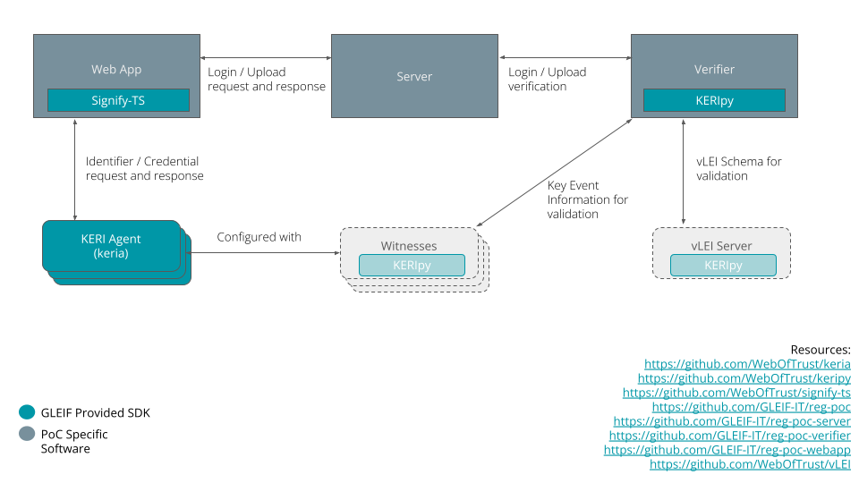

# reg-poc

Proof of concept for ECR login, file upload and verification.

### Build
```
docker-compose up --build
```


### Run
Navigate to [http://localhost:5173/](http://localhost:5173/) in your browser.

Use the passcode `0123456789abcdefghijk`.


### Upload

Samples can be found under the `samples/` directory.


### Architecture

This brings together all the moving pieces inside this PoC.

* Witness network ([keripy](https://github.com/weboftrust/keripy))
* vLEI server (cached schema) ([vLEI](https://github.com/weboftrust/vlei))
* KERI Agent ([keria](https://github.com/weboftrust/keria))
* [reg-poc-webapp](https://github.com/GLEIF-IT/reg-poc-webapp)
* [reg-poc-verifier](https://github.com/GLEIF-IT/reg-poc-verifier)
* [reg-poc-server](https://github.com/GLEIF-IT/reg-poc-server)

The `data` directory contains the output from a [signifypy](https://github.com/weboftrust/signifypy) script that establishes the Root of Trust, Qualified vLEI Issuer, Legal Entity, ECR Auth and ECR credentials [here](https://github.com/WebOfTrust/signifypy/blob/main/scripts/issue-ecr.sh).


